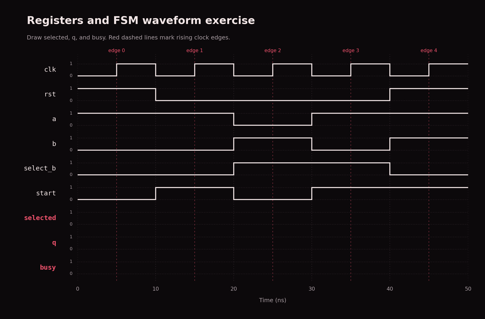

# Shared introduction

[Home](../README.md) · [CAE setup](SETUP.md) · [RTL](../rtl/README.md#rtl-track) · [Verification](../verif/README.md#verification-track)

Work through the lessons and exercises on this page, then choose a track.
All commands run from the repository root in the [CAE environment](SETUP.md).
Stages 1 and 2 are practice; the shared completion check is the PE at the end
of Stage 3.

## On this page

- [Stage 1: digital logic](#stage-1-digital-logic)
- [Day 1 exercises and waveforms](#day-1-exercises)
- [Clocked waveform practice](#clocked-waveform-practice)
- [Stage 2: SystemVerilog and systolic arrays](#stage-2-systemverilog-and-systolic-arrays)
- [Stage 3: implement a PE](#stage-3-implement-a-processing-element)
- [PE checkpoint](#pe-checkpoint)
- [Resources](#resources) and [code map](#code-map)

The digital-logic examples are complete. The PE is a student starter and needs
implementation. Its [behavior specification](projects/processing-element/spec/pe.md)
is shared by both tracks.

## Stage 1: digital logic

**Start here if:** you have not yet covered ECE 551-level digital logic.
**Outcome:** turn combinational Verilog into a circuit and predict its waveforms.

Use [Day 1 - Intro to Digital Design](https://docs.google.com/presentation/d/1SAHNdYWFLrHHiZuEiG2hlx5jGUWqrsGXg6sV9CP4wyk/edit) as the lesson, then use this guide
as its code and exercise companion.

### Follow the slides into the code

| Slide | Exact code section | What to notice or try |
| --- | --- | --- |
| [10: AND, OR, XOR and inverted gates](https://docs.google.com/presentation/d/1SAHNdYWFLrHHiZuEiG2hlx5jGUWqrsGXg6sV9CP4wyk/edit#slide=id.hac8044442db3b75_0_69) | [Gate assignments](projects/digital-logic/rtl/day1_combinational.v#L9-L14)<!-- region:gates --> | Each assignment describes a continuously active gate. Write the four-row truth table for each output. |
| [11: Mux](https://docs.google.com/presentation/d/1SAHNdYWFLrHHiZuEiG2hlx5jGUWqrsGXg6sV9CP4wyk/edit#slide=id.hac8044442db3b75_0_104), [13: Wires](https://docs.google.com/presentation/d/1SAHNdYWFLrHHiZuEiG2hlx5jGUWqrsGXg6sV9CP4wyk/edit#slide=id.hac8044442db3b75_0_74) | [Wire ports](projects/digital-logic/rtl/day1_combinational.v#L4-L7)<!-- region:wires --> | Inputs come from outside the module. Outputs are nets driven by the assignments below. |
| [14: Assign statement](https://docs.google.com/presentation/d/1SAHNdYWFLrHHiZuEiG2hlx5jGUWqrsGXg6sV9CP4wyk/edit#slide=id.hac8044442db3b75_0_94), [15: Full-adder exercise](https://docs.google.com/presentation/d/1SAHNdYWFLrHHiZuEiG2hlx5jGUWqrsGXg6sV9CP4wyk/edit#slide=id.hac8044442db3b75_0_99) | [`sum` and `carry`](projects/digital-logic/rtl/day1_combinational.v#L15-L17)<!-- region:full_adder --> | Draw the XOR chain for sum and the AND/OR network for carry before opening [slide 16's diagram](https://docs.google.com/presentation/d/1SAHNdYWFLrHHiZuEiG2hlx5jGUWqrsGXg6sV9CP4wyk/edit#slide=id.h4cf8405da22affe9_20_0). |
| [17: Muxing](https://docs.google.com/presentation/d/1SAHNdYWFLrHHiZuEiG2hlx5jGUWqrsGXg6sV9CP4wyk/edit#slide=id.hac8044442db3b75_0_109) | [`mux_out`](projects/digital-logic/rtl/day1_combinational.v#L18-L19)<!-- region:mux --> | `sel ? a : b` selects `a` when `sel` is 1. The order of the two branches matters. |
| [19: Waveforms](https://docs.google.com/presentation/d/1SAHNdYWFLrHHiZuEiG2hlx5jGUWqrsGXg6sV9CP4wyk/edit#slide=id.hac8044442db3b75_0_89), [20: Full-adder waveforms](https://docs.google.com/presentation/d/1SAHNdYWFLrHHiZuEiG2hlx5jGUWqrsGXg6sV9CP4wyk/edit#slide=id.h4cf8405da22affe9_20_39) | [Full-adder arithmetic check](projects/digital-logic/tb/day1_combinational_tb.sv#L26-L47)<!-- region:exhaustive_checks --> | At each input combination, the two-bit result `{carry, sum}` equals `a + b + c`. The inputs on slide 20 enumerate 000 through 111. |
| [21: Draw the output waveforms](https://docs.google.com/presentation/d/1SAHNdYWFLrHHiZuEiG2hlx5jGUWqrsGXg6sV9CP4wyk/edit#slide=id.hac8044442db3b75_0_124) | [`out1` and `out2`](projects/digital-logic/rtl/day1_combinational.v#L20-L22)<!-- region:waveform_exercise --> and [matching input trace](projects/digital-logic/tb/day1_combinational_tb.sv#L13-L25)<!-- region:slide21_trace --> | Predict both output expressions across the slide's eight intervals. The [worksheet](#day-1-exercises) shows the input waveforms with blank output traces. |

The Day 1 file uses Verilog `wire` and `assign` to match the deck. There is no clock
or storage in these circuits. The testbench uses SystemVerilog to automate checks;
you can run it without understanding every testbench construct yet. Later examples
use `logic`, `always_comb`, and `always_ff`, introduced in [Stage 2](#stage-2-systemverilog-and-systolic-arrays).

### Do the exercises

1. Complete the [Day 1 worksheet](#day-1-exercises),
   including the full-adder drawing and waveform predictions.
2. Run `make day1` at the repository root. Expect
   `PASS: Day 1 gates, full adder, mux, and waveform exercise (16 combinations)`.
3. Follow the [CAE viewer instructions](SETUP.md#5-view-waveforms-on-the-cae-desktop)
   to open `build/day1/waves.vcd` in GTKWave and add `a`, `b`, `c`, `out1`, and `out2`.
   Compare the first 80 ns with slide 21. Later intervals exercise all 16
   combinations of the three data inputs and mux selector.
4. Explain a prediction you corrected, or justify the transitions if all matched.

The simulator uses 10 ns per input interval to make the trace easy to view. The
slide's diagram has no numeric timescale. These RTL examples omit gate propagation
delay, so they do not demonstrate real circuit delays or glitches.

### Registers and FSMs

[Slide 23](https://docs.google.com/presentation/d/1SAHNdYWFLrHHiZuEiG2hlx5jGUWqrsGXg6sV9CP4wyk/edit#slide=id.hac8044442db3b75_0_79) introduces storage and clock-triggered updates.
[Slides 24–26](https://docs.google.com/presentation/d/1SAHNdYWFLrHHiZuEiG2hlx5jGUWqrsGXg6sV9CP4wyk/edit#slide=id.hac8044442db3b75_0_42) reserve space for FSMs, but the reviewed draft has a
section title, a blank content slide, and an exercise title without its prompt.
The following are repository extensions available for a mentor-led follow-up:

| Open | What is happening | Follow-up exercise |
| --- | --- | --- |
| [`q` register](projects/digital-logic/rtl/logic_basics.sv#L9-L13)<!-- region:register --> | A rising edge samples the mux output unless synchronous reset is asserted. | Predict the [clocked waveform worksheet](#clocked-waveform-practice). |
| [`state` and `next_state`](projects/digital-logic/rtl/logic_basics.sv#L14-L28)<!-- region:fsm --> | Combinational logic chooses the next state; a register remembers it. | Draw IDLE/BUSY and explain what happens when `start` stays high. |

Run `make smoke` to check both the Day 1 circuits and these completed extensions.
Detailed register coding continues in Stage 2, matching the
[next-meeting agenda on slide 27](https://docs.google.com/presentation/d/1SAHNdYWFLrHHiZuEiG2hlx5jGUWqrsGXg6sV9CP4wyk/edit#slide=id.hac8044442db3b75_0_135).

### Next step

Use the [foundations resources](#digital-logic) for gaps, then
continue to [Stage 2](#stage-2-systemverilog-and-systolic-arrays). These exercises are practice for the
shared PE project.

### Day 1 exercises

#### Gates and mux

For slides 10–11, write truth tables for AND, OR, XOR, NAND, NOR, and XNOR.
Then use [slide 17](https://docs.google.com/presentation/d/1SAHNdYWFLrHHiZuEiG2hlx5jGUWqrsGXg6sV9CP4wyk/edit#slide=id.hac8044442db3b75_0_109) to explain the output of `sel ? a : b`
when `sel` is 0 and when it is 1. Try `a = 1, b = 0` so the branches differ.

#### Full adder

Follow [slide 15](https://docs.google.com/presentation/d/1SAHNdYWFLrHHiZuEiG2hlx5jGUWqrsGXg6sV9CP4wyk/edit#slide=id.hac8044442db3b75_0_99). Draw the gates and wires for:

```verilog
assign sum = a ^ b ^ c;
assign carry = (a & b) | (b & c) | (a & c);
```

Fill the outputs for inputs 000 through 111. Explain why `{carry, sum}` encodes
the number of high inputs. Compare your drawing with
[slide 16](https://docs.google.com/presentation/d/1SAHNdYWFLrHHiZuEiG2hlx5jGUWqrsGXg6sV9CP4wyk/edit#slide=id.h4cf8405da22affe9_20_0) and your predicted outputs with
[slide 20](https://docs.google.com/presentation/d/1SAHNdYWFLrHHiZuEiG2hlx5jGUWqrsGXg6sV9CP4wyk/edit#slide=id.h4cf8405da22affe9_20_39).

#### Slide 21 waveform exercise

Draw `out1` and `out2` for [slide 21](https://docs.google.com/presentation/d/1SAHNdYWFLrHHiZuEiG2hlx5jGUWqrsGXg6sV9CP4wyk/edit#slide=id.hac8044442db3b75_0_124):

```verilog
assign out1 = (a & b) | c;
assign out2 = (a ^ c) & b;
```

The input traces match the eight intervals on slide 21. Draw the missing output
traces before running the example. The numeric times apply only to our simulator.


Run from the repository root:

```sh
make day1
```

Open `build/day1/waves.vcd` using the [CAE waveform-viewing instructions](SETUP.md#5-view-waveforms-on-the-cae-desktop).
Inspect the first 80 ns for this exercise. From 80 ns onward, the testbench exhausts all combinations of
`a`, `b`, `c`, and `sel`. Explain one output transition using the corresponding
expression, rather than only comparing pictures.

#### Next step

The [clocked waveform worksheet](#clocked-waveform-practice) is optional practice after
registers and FSMs have been introduced.

### Clocked waveform practice

This is the optional register/FSM follow-up. For the Day 1 full-adder and
combinational waveform exercises, use the [Day 1 worksheet](#day-1-exercises).

Read the [digital logic guide](#stage-1-digital-logic).
The inputs below change on falling edges and remain stable before the next
rising edge. Draw `selected`, `q`, and `busy` on the empty signal lanes.
`selected` is combinational; `q` and `busy` update after rising edges.
At edge 0 (5 ns), synchronous reset initializes the registers. Their values
before that first edge are unspecified; begin those output traces at edge 0.



1. Draw the AND and mux circuits represented by the continuous assignments.
2. Draw the IDLE/BUSY transition diagram. What happens when `start` stays high?
3. Use these input waveforms as stimulus in your branch; the existing smoke test has its own
   stimulus, so it does not reproduce this worksheet automatically.
4. Explain why changing `select_b` between edges affects `selected` immediately
   but does not immediately change `q`.

## Stage 2: SystemVerilog and systolic arrays

**Prerequisite:** the [Stage 1 material](#stage-1-digital-logic).
**Outcome:** connect HDL syntax to hardware and explain one PE's job.

Day 1 uses `wire` and `assign` for combinational circuits. Here we introduce
SystemVerilog `logic` and procedural blocks. A `logic` declaration alone does not
imply a physical register; the assignments and event controls describe whether
hardware stores state. The [Day 1 follow-up](#registers-and-fsms)
provides the register and FSM examples used below.

### HDL describes concurrent hardware

The [`assign` statements](projects/digital-logic/rtl/logic_basics.sv#L7-L8)<!-- region:combinational -->
represent hardware operating concurrently. They are not a sequence of software
instructions. The [`always_ff` block](projects/digital-logic/rtl/logic_basics.sv#L9-L13)<!-- region:register -->
represents edge-triggered storage. Nonblocking assignments (`<=`) schedule
registered updates; the right-hand sides use values from before those updates.
In the [FSM's `always_comb` block](projects/digital-logic/rtl/logic_basics.sv#L14-L28)<!-- region:fsm -->,
default assignments ensure a next-state value on every path.

### From matrix multiplication to a PE

For `C = A × B`, element `C[i,j]` is the sum of `A[i,k] * B[k,j]` over `k`.
A processing element can accumulate those products over multiple cycles. In an
output-stationary array, each PE keeps one result while operands travel to its
neighbors. Input timing must align matching `k` values; simply wiring PEs into a
grid is not enough.

Open the [PE ports](projects/processing-element/rtl/pe.sv#L7-L11)<!-- region:interface -->, then read
its [cycle contract](projects/processing-element/spec/pe.md#cycle-rules).
`a_out` and `b_out` will carry operands onward, `acc_out` will retain the sum, and
`valid_out` will identify useful forwarded data. Array scheduling is a later task.

### Do the exercise

1. Compute `[[1,2],[3,4]] × [[5,6],[7,8]]` by hand. The expected result is
   `[[19,22],[43,50]]`; show the two products contributing to each entry.
2. Draw one PE with a multiplier, adder, accumulator register, operand registers,
   and valid register. Mark reset and clear behavior.
3. Trace the first output dot product across two valid cycles and one inserted bubble.
4. Explain why multiplication and accumulation require attention to signedness
   and bit width. Read the [arithmetic contract](projects/processing-element/spec/pe.md#interface-and-arithmetic).

### Next step

You can map each PE signal to your diagram and distinguish valid operand
forwarding from completion of the full matrix operation. Read the
[systolic resources](#systolic-arrays), then continue to the
[PE implementation guide](#stage-3-implement-a-processing-element).

## Stage 3: implement a processing element

**Prerequisite:** [Stage 2](#stage-2-systemverilog-and-systolic-arrays).
**Outcome:** implement the shared RTL/verification starter and explain its behavior.

### Read before editing

The [PE contract](projects/processing-element/spec/pe.md) is the source of truth
for this exercise. Its interface is a proposed teaching choice, not a finalized
team SoC interface. The [RTL implementation region](projects/processing-element/rtl/pe.sv#L13-L21)<!-- region:implementation -->
currently ties outputs to zero. It compiles, but cannot pass the supplied acceptance suite.

```sh
make pe
```

The untouched starter fails on the first nonzero multiply-accumulate. That gives
you a concrete starting point for the implementation.

### Build in small steps

1. Replace the placeholder assignments with registered behavior. Implement the
   synchronous reset and clear priorities first.
2. Form a signed product with explicit width; extend it to the accumulator width.
3. Accumulate only when `valid_in` is asserted. Hold the accumulator on bubbles.
4. Forward operands on valid cycles, retain them on bubbles, and update the valid flag.
5. Rerun `make pe` and inspect `build/pe/waves.vcd` when a check fails.

### Use the supplied reference testbench

The testbench is provided and complete for the shared PE checkpoint. Implement
`pe.sv`; you do not need to write or extend the testbench before advancing.

The [`step` task](projects/processing-element/tb/pe_tb.sv#L75-L107)<!-- region:checker -->
drives inputs on falling edges, checks that outputs hold before the next rising
edge, then compares every output after the registered updates settle. Failures
show the widths, seed, phase, cycle, inputs, and actual/expected outputs.
The [reference model](projects/processing-element/tb/pe_tb.sv#L32-L74)<!-- region:model -->
computes products with shift/add arithmetic and tracks the expected accumulator
and forwarded operands independently of the DUT.

`make pe` runs all seven [width configurations](projects/processing-element/tb/pe_tb.sv#L244-L272)<!-- region:configurations -->:
`DATA_W/ACC_W` = `1/2`, `2/4`, `4/11`, `8/16`, `8/32`, `17/40`, and `33/72`.
The [test phases](projects/processing-element/tb/pe_tb.sv#L137-L242)<!-- region:stimulus --> include:

- All 65,536 operand pairs at each 8-bit configuration, both in isolation and
  back to back; all pairs at the smaller widths too.
- All 64 transitions between reset/clear/valid combinations, synchronous timing,
  reset after work, clear overriding valid, repeated bubbles, and restarting.
- Signed minimum/maximum values, zero, ±1, forwarding, and accumulator wraparound
  in both directions, including the default 32-bit accumulator. One-bit operands
  cannot produce a negative product, so that configuration checks positive wrap only.
- 4,000 reproducible random cycles per configuration, including widths beyond
  32-bit operands and 64-bit accumulators.

This is extensive simulation coverage, not an exhaustive proof of every possible
sequence or legal parameter value. It gives everyone the same PE acceptance bar.

For debugging, `build/pe/waves.vcd` includes all seven DUTs for the first 10 µs.
For a later failure, record the entire run or try another random seed:

```sh
make pe SIM_ARGS="+PE_WAVES"
make pe SIM_ARGS="+PE_SEED=12345"
```

Full-run waveforms can be large. Find the failing configuration in GTKWave using
its instance name (for example, `default_width` for `8/32`). The phase and cycle
in the failure message identify where to inspect; cycle 1 is sampled at 16 ns,
and subsequent samples are 10 ns apart. Seed values on the command line are decimal;
the failure message prints the seed in hexadecimal.

### PE checkpoint

Run `make pe` against your completed PE using the supplied testbench. Advance when
all seven configurations print `CHECKED:` and the run ends with
`PASS: PE acceptance suite (7 configurations; all checks complete)`.
Explain how your implementation follows the [contract](projects/processing-element/spec/pe.md)
for signed accumulation, forwarding, reset, clear, and bubbles. The untouched RTL
starter intentionally fails; no testbench implementation is required here.

After this checkpoint, continue to the [RTL track](../rtl/README.md#rtl-track) or the
[verification track](../verif/README.md#verification-track). This is the final shared stage.

## Resources

Read with a question in mind, then return to the linked exercise. These resources
were linked in the team discussion unless labeled “added.” External access and
course permissions may vary.

### Digital logic

Start with [Day 1 - Intro to Digital Design](https://docs.google.com/presentation/d/1SAHNdYWFLrHHiZuEiG2hlx5jGUWqrsGXg6sV9CP4wyk/edit), the team
slideshow reviewed on 2026-09-27. The [Stage 1 companion](#stage-1-digital-logic)
links specific slides to matching RTL, a full-adder exercise, and the slide 21
waveform exercise. The deck is still a draft, with FSM content unfinished.

| Resource | Use it for | Apply it |
| --- | --- | --- |
| [UW ECE 252](https://ece252.engr.wisc.edu/) | Background digital-system material | [Stage 1](#stage-1-digital-logic) |
| [UW ECE 352](https://ece352.engr.wisc.edu/) | Logic design material and lecture resources | [Waveform exercise](#clocked-waveform-practice) |

### Tools

| Resource | Use it for |
| --- | --- |
| [CAE remote access](https://kb.wisc.edu/cae/106117) | Reach a CAE Linux machine |
| [CAE software guide](https://kb.wisc.edu/cae/163133) | Understand module and container launch steps |
| [CAE EDA quickstart](https://kb.wisc.edu/cae/163136) | Launch an EDA environment |
| [Icarus Verilog documentation](https://steveicarus.github.io/iverilog/) (added) | Local simulator setup and usage |

See [repository-specific setup](SETUP.md#environment-setup) before translating generic tool examples.
The CAE module/container workflow and introductory VCS simulations were tested
over SSH on 2026-09-27; see [setup](SETUP.md) for the tested scope.

### Systolic arrays

| Resource | Use it for | Apply it |
| --- | --- | --- |
| [NYCU systolic-array lab](https://nycu-caslab.github.io/AAML2024/labs/lab_3.html) | A separate teaching example of matrix-accelerator construction | Compare its dataflow with your [PE diagram](#stage-2-systemverilog-and-systolic-arrays) |
| [Systolic array background](https://en.wikipedia.org/wiki/Systolic_array) | Optional terminology and historical context | Follow references for deeper reading |
| [Video from the discussion](https://www.youtube.com/watch?v=2VrnkXd9QR8) | Optional visual intuition | The source discussion flags inaccuracies; check timing/arithmetic against the exercise contract |

## Code map

These are the current implemented examples and student starter. Line links open
exact sections on GitHub; search the linked signal, task, or module name in a local editor.

| Concept | Exact location | Explanation |
| --- | --- | --- |
| Day 1 gates | [`gate_and … gate_xnor`](projects/digital-logic/rtl/day1_combinational.v#L9-L14)<!-- region:gates --> | [Day 1 companion](#stage-1-digital-logic) |
| Full adder | [`sum and carry`](projects/digital-logic/rtl/day1_combinational.v#L15-L17)<!-- region:full_adder --> | [Full-adder exercise](#full-adder) |
| Day 1 mux | [`mux_out`](projects/digital-logic/rtl/day1_combinational.v#L18-L19)<!-- region:mux --> | [Day 1 companion](#stage-1-digital-logic) |
| Slide 21 expressions | [`out1 and out2`](projects/digital-logic/rtl/day1_combinational.v#L20-L22)<!-- region:waveform_exercise --> | [Waveform exercise](#slide-21-waveform-exercise) |
| Slide 21 inputs | [`interval calls`](projects/digital-logic/tb/day1_combinational_tb.sv#L13-L25)<!-- region:slide21_trace --> | [Day 1 companion](#stage-1-digital-logic) |
| Gates and mux (follow-up) | [`both_high and selected`](projects/digital-logic/rtl/logic_basics.sv#L7-L8)<!-- region:combinational --> | [Stage 1](#stage-1-digital-logic) |
| Clocked storage | [`q`](projects/digital-logic/rtl/logic_basics.sv#L9-L13)<!-- region:register --> | [Stage 2](#stage-2-systemverilog-and-systolic-arrays) |
| State machine | [`state and next_state`](projects/digital-logic/rtl/logic_basics.sv#L14-L28)<!-- region:fsm --> | [Stage 1](#stage-1-digital-logic) |
| Executable checks | [`logic_basics_tb`](projects/digital-logic/tb/logic_basics_tb.sv#L8-L32)<!-- region:checks --> | [Verification](../verif/README.md#getting-started-with-verification) |
| PE signals | [`pe ports`](projects/processing-element/rtl/pe.sv#L7-L11)<!-- region:interface --> | [PE contract](projects/processing-element/spec/pe.md) |
| Student implementation | [`pe body`](projects/processing-element/rtl/pe.sv#L13-L21)<!-- region:implementation --> | [PE guide](#stage-3-implement-a-processing-element) |
| Testbench driver/checker | [`check_outputs and step`](projects/processing-element/tb/pe_tb.sv#L75-L107)<!-- region:checker --> | [Verification](../verif/README.md#getting-started-with-verification) |
| PE acceptance cases | [`run_tests`](projects/processing-element/tb/pe_tb.sv#L137-L242)<!-- region:stimulus --> | [Verification plan](../verif/README.md#pe-verification-plan) |

## About these lessons

### Source material

The scaffold draws on the [onboarding discussion](https://docs.google.com/document/d/1cHGKrhfTHdkPz5xHHztMZczXaK1vkzcBipxWeBamP2E/edit?tab=t.96ol04gxq2rg)
and [Day 1 slideshow](https://docs.google.com/presentation/d/1SAHNdYWFLrHHiZuEiG2hlx5jGUWqrsGXg6sV9CP4wyk/edit),
reviewed on 2026-09-27. The discussion is a draft rather than an approved syllabus.
The slideshow's three common stages lead into the two tracks represented here.

The Stage 1 guide links slides to matching examples. Slides 24–26 in the reviewed
deck still contain FSM placeholders, so the clocked examples are optional
follow-up material until that lesson is ready.

### Shared open decisions

- Finish the Day 1 FSM lesson. The shared completion check is the [PE checkpoint](#pe-checkpoint).
- Confirm the proposed teaching PE's widths, signedness, and reset/clear behavior.
- Keep the shared CAE setup guide current as tool versions change.
- Assign mentors to help members choose an appropriate starting point.

The exercise code, PE contract, and documentation conventions make this scaffold
usable; they should not be read as previously approved team design decisions.
