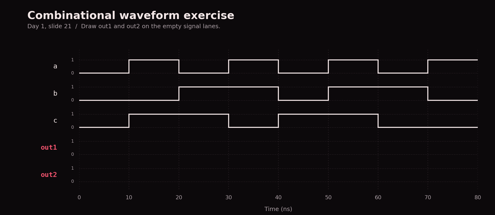

# Shared introduction

[Home](../README.md) · [CAE setup](SETUP.md) · [RTL](../rtl/README.md#rtl-track) · [Verification](../verif/README.md#verification-track)

Over the next three weeks, we'll work through digital logic, SystemVerilog, and a
processing element project. You're welcome to work ahead. After the introduction,
you'll choose the RTL/design or verification track. Follow the [CAE setup guide](SETUP.md)
before Stage 3; you can also use that environment to run the optional examples in
Stages 1 and 2.

## On this page

- [Stage 1: digital logic](#stage-1-digital-logic)
- [Day 1 exercises and waveforms](#day-1-exercises)
- [Stage 2: SystemVerilog and systolic arrays](#stage-2-systemverilog-and-systolic-arrays)
  - [Modules and ports](#modules-and-ports) · [Signal declarations](#signals-wire-reg-and-logic)
  - [Concurrent hardware](#hdl-describes-concurrent-hardware) · [`if` and procedural blocks](#if-statements-and-procedural-blocks)
  - [Slide companion](#read-the-code-alongside-the-slides-1) · [Sequential practice](#trace-and-draw-a-sequential-circuit-optional)
  - [Run the example](#run-the-register-and-fsm-example-optional) · [Matrix and PE practice](#matrix-and-pe-practice-optional)
- [Stage 3: implement a PE](#stage-3-implement-a-processing-element)
- [PE checkpoint](#pe-checkpoint)
- [Resources](#resources) and [code map](#code-map)

In Stage 3, you'll implement a processing element (PE): a circuit that multiplies
two inputs and adds their product to a running sum. The starter RTL file provides
the interface, and the [behavior specification](projects/processing-element/spec/pe.md)
describes what to implement.

## Stage 1: digital logic

Start here if you haven't covered ECE 551-level digital logic. Use the
[Day 1 – Intro to Digital Design](https://docs.google.com/presentation/d/1SAHNdYWFLrHHiZuEiG2hlx5jGUWqrsGXg6sV9CP4wyk/edit)
slideshow for the overview, then explore the matching code and optional exercises below.

### Read the code alongside the slides

Use these examples to connect the slides to working circuits. The suggested exercises are optional.

| Slide | Code to open | What to notice or try |
| --- | --- | --- |
| [10: AND, OR, XOR and inverted gates](https://docs.google.com/presentation/d/1SAHNdYWFLrHHiZuEiG2hlx5jGUWqrsGXg6sV9CP4wyk/edit#slide=id.hac8044442db3b75_0_69) | [Gate assignments](projects/digital-logic/rtl/day1_combinational.v#L9-L14)<!-- region:gates --> | Each assignment describes a continuously active gate. Write the four-row truth table for each output. |
| [11: Mux](https://docs.google.com/presentation/d/1SAHNdYWFLrHHiZuEiG2hlx5jGUWqrsGXg6sV9CP4wyk/edit#slide=id.hac8044442db3b75_0_104), [13: Wires](https://docs.google.com/presentation/d/1SAHNdYWFLrHHiZuEiG2hlx5jGUWqrsGXg6sV9CP4wyk/edit#slide=id.hac8044442db3b75_0_74) | [Wire ports](projects/digital-logic/rtl/day1_combinational.v#L4-L7)<!-- region:wires --> | Inputs come from outside the module. Outputs are nets driven by the assignments below. |
| [14: Assign statement](https://docs.google.com/presentation/d/1SAHNdYWFLrHHiZuEiG2hlx5jGUWqrsGXg6sV9CP4wyk/edit#slide=id.hac8044442db3b75_0_94), [15: Full-adder exercise](https://docs.google.com/presentation/d/1SAHNdYWFLrHHiZuEiG2hlx5jGUWqrsGXg6sV9CP4wyk/edit#slide=id.hac8044442db3b75_0_99) | [`sum` and `carry`](projects/digital-logic/rtl/day1_combinational.v#L15-L17)<!-- region:full_adder --> | Draw the XOR chain for sum and the AND/OR network for carry before opening [slide 16's diagram](https://docs.google.com/presentation/d/1SAHNdYWFLrHHiZuEiG2hlx5jGUWqrsGXg6sV9CP4wyk/edit#slide=id.h4cf8405da22affe9_20_0). |
| [17: Muxing](https://docs.google.com/presentation/d/1SAHNdYWFLrHHiZuEiG2hlx5jGUWqrsGXg6sV9CP4wyk/edit#slide=id.hac8044442db3b75_0_109) | [`mux_out`](projects/digital-logic/rtl/day1_combinational.v#L18-L19)<!-- region:mux --> | `sel ? a : b` selects `a` when `sel` is 1. The order of the two branches matters. |
| [19: Waveforms](https://docs.google.com/presentation/d/1SAHNdYWFLrHHiZuEiG2hlx5jGUWqrsGXg6sV9CP4wyk/edit#slide=id.hac8044442db3b75_0_89), [20: Full-adder waveforms](https://docs.google.com/presentation/d/1SAHNdYWFLrHHiZuEiG2hlx5jGUWqrsGXg6sV9CP4wyk/edit#slide=id.h4cf8405da22affe9_20_39) | [Full-adder arithmetic check](projects/digital-logic/tb/day1_combinational_tb.sv#L26-L47)<!-- region:exhaustive_checks --> | At each input combination, the two-bit result `{carry, sum}` equals `a + b + c`. The inputs on slide 20 enumerate 000 through 111. |
| [21: Draw the output waveforms](https://docs.google.com/presentation/d/1SAHNdYWFLrHHiZuEiG2hlx5jGUWqrsGXg6sV9CP4wyk/edit#slide=id.hac8044442db3b75_0_124) | [`out1` and `out2`](projects/digital-logic/rtl/day1_combinational.v#L20-L22)<!-- region:waveform_exercise --> and [matching input trace](projects/digital-logic/tb/day1_combinational_tb.sv#L13-L25)<!-- region:slide21_trace --> | Predict both output expressions across the slide's eight intervals. The [worksheet](#day-1-exercises) shows the input waveforms with blank output traces. |

The Day 1 circuits have no clock. The supplied SystemVerilog testbench drives their
inputs and checks their outputs. You can run it before learning how the testbench itself works.

### Do the exercises (optional but encouraged)

1. Complete the [Day 1 worksheet](#day-1-exercises) (these are the exercises in the slides),
   including the full-adder drawing and waveform predictions.
2. Run `make day1` at the repository root. Expect
   `PASS: Day 1 gates, full adder, mux, and waveform exercise (16 combinations)`.
3. Follow the [CAE viewer instructions](SETUP.md#5-view-waveforms-on-the-cae-desktop)
   to open `build/day1/waves.vcd` in GTKWave. Add `a`, `b`, `c`, `out1`, and `out2`,
   then compare the first 80 ns with slide 21. From 80 ns onward, the testbench
   checks all 16 combinations of `a`, `b`, `c`, and `sel`. Each of the four binary
   inputs has two possible values, giving `2⁴ = 16` combinations.

The simulation uses 10 ns per interval so the waveforms are easy to inspect.
The slide waveforms omit numeric times.

Use the [digital logic resources](#digital-logic) to revisit anything you want to
understand better, then continue to [Stage 2](#stage-2-systemverilog-and-systolic-arrays).

### Day 1 exercises

#### Gates and mux

For slides 10–11, write truth tables for AND, OR, XOR, NAND, NOR, and XNOR.
Then use [slide 17](https://docs.google.com/presentation/d/1SAHNdYWFLrHHiZuEiG2hlx5jGUWqrsGXg6sV9CP4wyk/edit#slide=id.hac8044442db3b75_0_109) to explain the output of `sel ? a : b`
when `sel` is 0 and when it is 1. Try `a = 1, b = 0` so the branches differ.

#### Full adder

Follow [slide 15](https://docs.google.com/presentation/d/1SAHNdYWFLrHHiZuEiG2hlx5jGUWqrsGXg6sV9CP4wyk/edit#slide=id.hac8044442db3b75_0_99). Draw the gates and wires for:

```verilog
assign sum = a ^ b ^ c;
assign carry = (a & b) | (b & c) | (a & c);
```

Fill the outputs for inputs 000 through 111. Explain why `{carry, sum}` encodes
the number of high inputs. Compare your drawing with
[slide 16](https://docs.google.com/presentation/d/1SAHNdYWFLrHHiZuEiG2hlx5jGUWqrsGXg6sV9CP4wyk/edit#slide=id.h4cf8405da22affe9_20_0) and your predicted outputs with
[slide 20](https://docs.google.com/presentation/d/1SAHNdYWFLrHHiZuEiG2hlx5jGUWqrsGXg6sV9CP4wyk/edit#slide=id.h4cf8405da22affe9_20_39).

#### Slide 21 waveform exercise

Draw `out1` and `out2` for [slide 21](https://docs.google.com/presentation/d/1SAHNdYWFLrHHiZuEiG2hlx5jGUWqrsGXg6sV9CP4wyk/edit#slide=id.hac8044442db3b75_0_124):

```verilog
assign out1 = (a & b) | c;
assign out2 = (a ^ c) & b;
```

The input traces match the eight intervals on slide 21. Draw the missing output
traces before running the example. The numeric times apply only to our simulator.



Use the [run and waveform-viewing instructions above](#do-the-exercises-optional-but-encouraged)
to compare your predictions with the first 80 ns of `build/day1/waves.vcd`.
If an output differs, evaluate its expression using the inputs in that interval.

## Stage 2: SystemVerilog and systolic arrays

Start this stage after you're comfortable with the [Stage 1 material](#stage-1-digital-logic).
Use the [Oct 7 meeting slides](https://docs.google.com/presentation/d/1Ix2XDtJfbOeGqoXGuWMjS9WQNwP62iEU4nWpcuQg98w/edit)
alongside this section. You'll learn how modules, signals, and clocked blocks
describe hardware, then connect those ideas to a processing element.
The exercises and simulation below are optional practice for Stage 3.

### Modules and ports

A `module` describes a hardware block. Its ports are the signals that connect it
to other blocks: an `input` comes into the block, and an `output` leaves it.
Open the [`logic_basics` module declaration](projects/digital-logic/rtl/logic_basics.sv#L3-L6)<!-- region:interface -->:

```systemverilog
module logic_basics (
    input  logic clk, rst, a, b, select_b, start,
    output logic both_high, selected, q, busy
);
```

The code between this declaration and `endmodule` describes the circuits inside
`logic_basics`. Each port here is one bit. `clk` is the clock, `rst` resets stored
state, and the other inputs supply data or control the block.

To use a module, create an instance and connect its ports. The supplied testbench
uses `logic_basics dut (.*);`: `dut` is the instance name, and `.*` connects ports
to testbench signals with the same names. An explicit connection such as
`.clk(test_clk)` connects the module's `clk` port to a signal named `test_clk`.
An instance represents a separate copy of the hardware; it doesn't act like a
software function call that runs and returns.

### Signals: `wire`, `reg`, and `logic`

The slides use Verilog's `wire` and `reg` declarations. The repository's `.sv`
examples use SystemVerilog, which adds `logic`, `always_ff`, and `always_comb`.

| Declaration | What it means | Typical use |
| --- | --- | --- |
| `wire` | A net: its value comes from its connected drivers. | Connect module ports or carry the result of an `assign` statement. |
| `reg` | A Verilog variable that can be assigned inside a procedural block, such as `always`. | Describe a clocked register or a combinational result computed in a block. |
| `logic` | A SystemVerilog four-state data type; a plain internal `logic` declaration creates a variable. | Declare signals assigned in `always_ff` or `always_comb`, or driven by a single continuous assignment. |

Four-state signals can represent `0`, `1`, `x` (unknown), and `z` (high impedance,
such as an undriven net). An uninitialized register can appear as `x` in simulation;
reset gives the registers in our example a known starting value.

The name `reg` doesn't create a physical register by itself, and `logic` doesn't
mean the signal is combinational. A driver is the assignment or connected output that supplies a signal's value.
The assignments describe the hardware:
`selected` is driven by a mux expression, while `q` stores a value on a clock edge.
Use `logic` for the single-driver signals in these exercises. Keep `wire` for net
connections, especially when modeling a connection with multiple drivers.
Give each signal one driver in the examples here; don't assign it from both an
`assign` statement and an `always_ff` block.

A range declares a group of bits, called a vector. `logic [7:0] count;` declares
eight bits, numbered 7 through 0. Plain vectors are unsigned; adding `signed`,
as in `logic signed [7:0] operand;`, makes arithmetic interpret the bits as a
signed two's-complement number. Eight unsigned bits represent 0 through 255;
eight signed bits represent −128 through 127. `1'b0` is a one-bit binary zero,
and `8'd3` is an eight-bit decimal value of three.

### HDL describes concurrent hardware

HDL means hardware description language. RTL (register-transfer level) describes
registers and the logic that computes their next values. Simulation evaluates
the behavior you describe; synthesis turns supported RTL into a circuit of gates
and registers.
Separate assignments, procedural blocks, and module instances operate concurrently.
Writing one block below another doesn't make the hardware run them in that order.

The [`assign` statements](projects/digital-logic/rtl/logic_basics.sv#L7-L8)<!-- region:combinational -->
describe combinational circuits: the output depends on the current inputs.
When an input changes, the affected output is reevaluated. For example,
`assign selected = select_b ? b : a;` describes a mux that selects `b` when
`select_b` is 1 and `a` when it is 0.

The [`always_ff` block](projects/digital-logic/rtl/logic_basics.sv#L9-L15)<!-- region:register -->
describes sequential logic: `q` remembers a value between clock edges.
`@(posedge clk)` runs the block when `clk` changes from 0 to 1. At that edge,
`q` captures `selected`, unless reset is asserted. This reset is synchronous:
`rst = 1` clears `q` at the next rising edge.

Use nonblocking assignments (`<=`) in clocked blocks. Their right-hand sides
are evaluated using the values at the edge, and their updates take effect afterward.
For example, if a block contains `b <= a + b;` and `a <= b;`, both expressions
use the old `b`. Starting from `a = 0, b = 1`, the next values are `a = 1, b = 1`.
On the following edge they become `a = 1, b = 2`.

### `if` statements and procedural blocks

A procedural block is a group of statements that runs when its triggering event
occurs. Within a block, statements are evaluated in order. An `if` chooses an
action based on a condition. `else` supplies the alternative,
and `else if` tests another condition when the earlier one is false.
In the `q` block, `if (rst)` selects zero when `rst` is 1; otherwise, `q` captures
`selected`. Inside a clocked block, the condition is evaluated at the clock edge.
Use `begin` and `end` to group several statements into a branch or block.
They can be omitted for a single statement, as in this example.

The [finite-state machine (FSM)](projects/digital-logic/rtl/logic_basics.sv#L16-L24)<!-- region:fsm -->
uses `busy` to remember one of two states: `0` for idle and `1` for busy.
The order of its branches gives reset priority over the other actions. With reset
low, an idle block captures `start`; a busy block returns to idle on the next
edge, even if `start` is still high.

You can also use `if` to describe a combinational mux in an `always_comb` block.
This is an alternative way to write the existing `selected` assignment:

```systemverilog
always_comb begin
    if (select_b)
        selected = b;
    else
        selected = a;
end
```

`always_comb` reevaluates when signals it reads change. Use blocking assignments
(`=`) here, so each statement updates its variable before the next statement runs.
Assign the output on every path through a combinational block. Omitting the
`else` here would require `selected` to retain its previous value when `select_b`
is 0, creating unintended storage. If you try this version, replace the existing
`assign selected` statement so the signal still has one driver.

### Read the code alongside the slides

| Slides | Repo companion | What to notice or try |
| --- | --- | --- |
| [21: Declare registers](https://docs.google.com/presentation/d/1Ix2XDtJfbOeGqoXGuWMjS9WQNwP62iEU4nWpcuQg98w/edit#slide=id.h4eca47d0806feab8_0_18) | [Signal declarations](#signals-wire-reg-and-logic) | Compare the slides' `reg` with the repo's `logic`; count the bits in `[7:0]`. |
| [22: Update registers](https://docs.google.com/presentation/d/1Ix2XDtJfbOeGqoXGuWMjS9WQNwP62iEU4nWpcuQg98w/edit#slide=id.h4eca47d0806feab8_0_23) | [`q` register](projects/digital-logic/rtl/logic_basics.sv#L9-L15)<!-- region:register --> | Follow the rising edge, reset branch, and nonblocking assignment. |
| [23: Sequential example](https://docs.google.com/presentation/d/1Ix2XDtJfbOeGqoXGuWMjS9WQNwP62iEU4nWpcuQg98w/edit#slide=id.h4eca47d0806feab8_0_28), [24: Draw the circuit](https://docs.google.com/presentation/d/1Ix2XDtJfbOeGqoXGuWMjS9WQNwP62iEU4nWpcuQg98w/edit#slide=id.h5b10e5ed2bbe2957_0_22) | [Sequential exercise](#trace-and-draw-a-sequential-circuit-optional) | Trace old and new values, then draw the registers and their input logic. |
| [7: Dot products](https://docs.google.com/presentation/d/1Ix2XDtJfbOeGqoXGuWMjS9WQNwP62iEU4nWpcuQg98w/edit#slide=id.h4eca47d0806feab8_0_8), [9: Matrix multiplication](https://docs.google.com/presentation/d/1Ix2XDtJfbOeGqoXGuWMjS9WQNwP62iEU4nWpcuQg98w/edit#slide=id.h7fa110571f7de399_0_30) | [Matrix multiplication and PE](#from-matrix-multiplication-to-a-pe) | Match a row of `A` with a column of `B` for each result. |
| [28: Draw a PE](https://docs.google.com/presentation/d/1Ix2XDtJfbOeGqoXGuWMjS9WQNwP62iEU4nWpcuQg98w/edit#slide=id.h5b10e5ed2bbe2957_0_11) | [PE practice](#matrix-and-pe-practice-optional) | Identify the stored values, arithmetic, and control signals. |

### Trace and draw a sequential circuit (optional)

Slides 23–24 use this clocked block, written here with `logic` declarations:

```systemverilog
logic [7:0] a, b, count;
always_ff @(posedge clk) begin
    if (count > 0) begin
        count <= count - 1;
        b <= a + b;
        a <= b;
    end
end
```

1. For a paper trace, assume `a = 0`, `b = 1`, and `count = 3` before the first
   rising edge. Predict all three registers after four edges. Use the old values
   for every right-hand side and for the condition.
2. Draw three eight-bit registers, an adder for `a + b`, a subtractor for
   `count - 1`, and a comparator for `count > 0`. Show how each register either
   loads its new value or holds its old value. You can draw that choice as a mux
   feeding each register. All three registers share `clk`.
3. Compare your diagram with [slide 25's solution](https://docs.google.com/presentation/d/1Ix2XDtJfbOeGqoXGuWMjS9WQNwP62iEU4nWpcuQg98w/edit#slide=id.codex_oct7_circuit_solution).

The expected `(a, b, count)` values are `(1, 1, 2)`, `(1, 2, 1)`, `(2, 3, 0)`,
and `(2, 3, 0)`. When `count` is zero, no assignment runs, so all three registers
hold their values. The snippet has no reset or initialization hardware; the
starting values are assumptions for this exercise. Results stored in these
eight-bit registers wrap modulo 256 if they exceed the available width.

### Run the register and FSM example (optional)

From the repository root in the [configured simulation environment](SETUP.md#environment-setup), run:

```sh
make smoke
```

This runs the Day 1 examples, then `logic_basics_tb`. Expect the latter to print
`PASS: digital logic smoke`. Its waveform file is `build/digital-logic/waves.vcd`.
Use the [CAE waveform viewer instructions](SETUP.md#5-view-waveforms-on-the-cae-desktop)
to open it and add `clk`, `rst`, `select_b`, `selected`, `q`, `start`, and `busy`.
Follow `selected` as inputs change, then compare `q` just before and after rising
edges. Trace the reset and idle/busy transitions against the two clocked blocks.

### From matrix multiplication to a PE

For `C = A × B`, the number of columns in `A` must equal the number of rows in
`B`. Multiplying an `M × K` matrix by a `K × N` matrix produces an `M × N`
result. For example, `(2 × 3) × (3 × 4)` produces a `2 × 4` matrix.

Each result `C[i,j]` is a dot product: multiply matching entries
from row `i` of `A` and column `j` of `B`, then add the products. A PE can build
that sum one product per valid clock cycle.

The animation builds each result from two products. The highlighted cell in `C`
shows the running sum; indices start at zero.

![Matrix multiplication of A = [[1,2],[3,4]] and B = [[5,6],[7,8]], highlighting matching row and column entries and accumulating C = [[19,22],[43,50]].](projects/processing-element/exercises/images/matmul.gif)

In an output-stationary systolic array, each PE holds one result while passing
operands to neighboring PEs. The input schedule brings matching `k` values to each
PE in the same cycle.

Open the [PE ports](projects/processing-element/rtl/pe.sv#L7-L11)<!-- region:interface -->
and read the [cycle rules](projects/processing-element/spec/pe.md#cycle-rules).
`a_out` and `b_out` forward operands, `acc_out` holds the running sum, and
`valid_out` marks valid forwarded operands. You'll work on array scheduling in
the [RTL track](../rtl/README.md#rtl-track).

### Matrix and PE practice (optional)

1. Compute `[[1,2],[3,4]] × [[5,6],[7,8]]` by hand. The expected result is
   `[[19,22],[43,50]]`; show the two products contributing to each entry.
2. Draw one PE with a multiplier, adder, accumulator register, operand registers,
   and valid register. Mark reset and clear behavior.
3. Trace the dot product for `C[0,0]` across two valid cycles, with a bubble between
   them. A bubble is a cycle with `valid_in = 0`; the accumulator and forwarded
   operands hold their values.
4. Explain why multiplication and accumulation require attention to signedness
   and bit width. Read the [arithmetic contract](projects/processing-element/spec/pe.md#interface-and-arithmetic).

Use the [systolic array resources](#systolic-arrays) for more examples, then
continue to [Stage 3](#stage-3-implement-a-processing-element) to implement your PE.

## Stage 3: implement a processing element

### Read before editing

You'll now implement the PE using the SystemVerilog concepts from
[Stage 2](#stage-2-systemverilog-and-systolic-arrays). Read the
[PE specification](projects/processing-element/spec/pe.md) for the required
arithmetic and cycle behavior, then open the
[implementation region](projects/processing-element/rtl/pe.sv#L13-L21)<!-- region:implementation -->
in `pe.sv`.

From the repository root in your configured simulation environment, run:

```sh
make pe
```

The starter ties its outputs to zero, so it fails until you implement the PE.

### Build in small steps

1. Replace the placeholder assignments with clocked logic. Apply reset first,
   then clear; both take effect on a rising clock edge.
2. Compute a signed product with `2 * DATA_W` bits, then sign-extend it to `ACC_W` bits.
3. When neither reset nor clear is asserted, accumulate and forward operands on
   cycles with `valid_in = 1`.
4. On bubbles, hold the accumulator and forwarded operands, and set `valid_out = 0`.
5. Rerun `make pe`. If a check fails, use its message and `build/pe/waves.vcd` to
   inspect the failing cycle.

### Use the supplied reference testbench

The supplied testbench checks your implementation against the PE specification.
For this checkpoint, your implementation work is in `pe.sv`.

The [`step` task](projects/processing-element/tb/pe_tb.sv#L75-L107)<!-- region:checker -->
drives inputs on falling clock edges and checks outputs before and after the next
rising edge. A [reference model](projects/processing-element/tb/pe_tb.sv#L32-L74)<!-- region:model -->
computes the expected accumulator, forwarded operands, and valid flag. Failure
messages include the configuration, seed, phase, cycle, inputs, and expected and actual outputs.

`make pe` tests seven [width configurations](projects/processing-element/tb/pe_tb.sv#L244-L272)<!-- region:configurations -->:
`DATA_W/ACC_W` = `1/2`, `2/4`, `4/11`, `8/16`, `8/32`, `17/40`, and `33/72`.
The [tests](projects/processing-element/tb/pe_tb.sv#L137-L242)<!-- region:stimulus -->
cover every operand pair through 8-bit inputs, reset/clear/valid transitions,
bubbles, signed boundary values, accumulator wraparound, and 4,000 reproducible
random cycles per configuration.

For debugging, `build/pe/waves.vcd` includes all seven DUTs for the first 10 µs.
For a later failure, record the entire run or try another random seed:

```sh
make pe SIM_ARGS="+PE_WAVES"
make pe SIM_ARGS="+PE_SEED=12345"
```

Full-run waveforms can be large. Find the failing configuration in GTKWave using
its instance name (for example, `default_width` for `8/32`). The phase and cycle
in the failure message identify where to inspect; cycle 1 is sampled at 16 ns,
and subsequent samples are 10 ns apart. Seed values on the command line are decimal;
the failure message prints the seed in hexadecimal.

### PE checkpoint

Run `make pe` with your completed implementation and the supplied testbench. The
checkpoint is complete when all seven configurations print `CHECKED:` and the run ends with:

```text
PASS: PE acceptance suite (7 configurations; all checks complete)
```

After this final shared stage, continue to the [RTL track](../rtl/README.md#rtl-track)
or [verification track](../verif/README.md#verification-track).

## Resources

Use these resources to revisit a concept or work through another example.

### Digital logic

Start with [Day 1 - Intro to Digital Design](https://docs.google.com/presentation/d/1SAHNdYWFLrHHiZuEiG2hlx5jGUWqrsGXg6sV9CP4wyk/edit). The [Stage 1 companion](#stage-1-digital-logic)
links specific slides to matching RTL, a full-adder exercise, and the slide 21
waveform exercise.

| Resource | Use it for | Apply it |
| --- | --- | --- |
| [UW ECE 252](https://ece252.engr.wisc.edu/) | Background digital-system material | [Stage 1](#stage-1-digital-logic) |
| [UW ECE 352](https://ece352.engr.wisc.edu/) | Logic design material and lecture resources | [Stage 1](#stage-1-digital-logic) |

### Tools

| Resource | Use it for |
| --- | --- |
| [CAE remote access](https://kb.wisc.edu/cae/106117) | Reach a CAE Linux machine |
| [CAE software guide](https://kb.wisc.edu/cae/163133) | Understand module and container launch steps |
| [CAE EDA quickstart](https://kb.wisc.edu/cae/163136) | Launch an EDA environment |
| [Icarus Verilog documentation](https://steveicarus.github.io/iverilog/) | Local simulator setup and usage |

### Systolic arrays

| Resource | Use it for | Apply it |
| --- | --- | --- |
| [NYCU systolic-array lab](https://nycu-caslab.github.io/AAML2024/labs/lab_3.html) | A separate teaching example of matrix-accelerator construction | Compare its dataflow with your [PE diagram](#stage-2-systemverilog-and-systolic-arrays) |
| [Systolic array background](https://en.wikipedia.org/wiki/Systolic_array) | Optional terminology and historical context | Follow references for deeper reading |
| [Systolic array video](https://www.youtube.com/watch?v=2VrnkXd9QR8) | Optional visual introduction | Compare operand timing and arithmetic with the [PE specification](projects/processing-element/spec/pe.md) |

## Code map

Use this table to find the examples and PE starter. On GitHub, the links open the
relevant lines. In a local editor, search for the listed signal, task, or module name.

| Concept | Exact location | Explanation |
| --- | --- | --- |
| Day 1 gates | [`gate_and … gate_xnor`](projects/digital-logic/rtl/day1_combinational.v#L9-L14)<!-- region:gates --> | [Day 1 companion](#stage-1-digital-logic) |
| Full adder | [`sum and carry`](projects/digital-logic/rtl/day1_combinational.v#L15-L17)<!-- region:full_adder --> | [Full-adder exercise](#full-adder) |
| Day 1 mux | [`mux_out`](projects/digital-logic/rtl/day1_combinational.v#L18-L19)<!-- region:mux --> | [Day 1 companion](#stage-1-digital-logic) |
| Slide 21 expressions | [`out1 and out2`](projects/digital-logic/rtl/day1_combinational.v#L20-L22)<!-- region:waveform_exercise --> | [Waveform exercise](#slide-21-waveform-exercise) |
| Slide 21 inputs | [`interval calls`](projects/digital-logic/tb/day1_combinational_tb.sv#L13-L25)<!-- region:slide21_trace --> | [Day 1 companion](#stage-1-digital-logic) |
| Gates and mux (follow-up) | [`both_high and selected`](projects/digital-logic/rtl/logic_basics.sv#L7-L8)<!-- region:combinational --> | [Stage 2](#stage-2-systemverilog-and-systolic-arrays) |
| Clocked storage | [`q`](projects/digital-logic/rtl/logic_basics.sv#L9-L15)<!-- region:register --> | [Stage 2](#stage-2-systemverilog-and-systolic-arrays) |
| State machine | [`busy`](projects/digital-logic/rtl/logic_basics.sv#L16-L24)<!-- region:fsm --> | [Stage 2](#stage-2-systemverilog-and-systolic-arrays) |
| Executable checks | [`logic_basics_tb`](projects/digital-logic/tb/logic_basics_tb.sv#L8-L32)<!-- region:checks --> | [Verification](../verif/README.md#getting-started-with-verification) |
| PE signals | [`pe ports`](projects/processing-element/rtl/pe.sv#L7-L11)<!-- region:interface --> | [PE contract](projects/processing-element/spec/pe.md) |
| Student implementation | [`pe body`](projects/processing-element/rtl/pe.sv#L13-L21)<!-- region:implementation --> | [PE guide](#stage-3-implement-a-processing-element) |
| Testbench driver/checker | [`check_outputs and step`](projects/processing-element/tb/pe_tb.sv#L75-L107)<!-- region:checker --> | [Verification](../verif/README.md#getting-started-with-verification) |
| PE acceptance cases | [`run_tests`](projects/processing-element/tb/pe_tb.sv#L137-L242)<!-- region:stimulus --> | [Verification plan](../verif/README.md#pe-verification-plan) |
